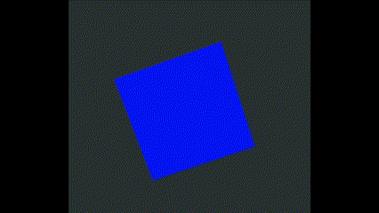

# Interactive 3D Cube Visualization

A WebGL-based 3D cube implementation with dynamic controls and lighting effects, built using p5.js and React.

## Features

- Interactive drag-based rotation with momentum
- Auto-rotation when idle
- Dynamic color-changing point light
- Smooth velocity damping system
- Window resize responsiveness
- Spacebar reset functionality
